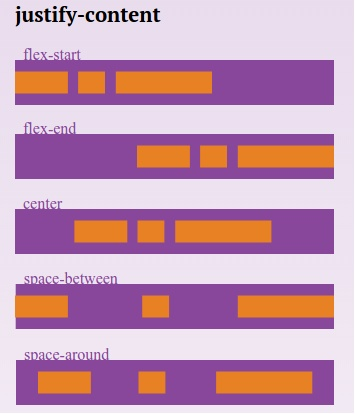

#Grid de 12 Columnas Usando Flexbox
  
##Elemento padre (flex container)
  
**.container-fluid**  
width: 100%  
**.container**  
width:100% - padding variable  
**.row**  
Es el elemento padre y tiene los siguientes atributos:  
```css
.row{
	box-sizing: border-box;
	display: flex;
	flex: 0 1 auto;
	flex-direction: row;
	flex-wrap: wrap;
}
```
##Elemento hijo (item)
  
Consideramos las columnas según los siguientes tamaños de Viewport:
```
xs:30em;	//480px
sm:37.5em;	//600px
md:48em;	//768px
lg:64em;	//1024px
xl:80em;	//1280px
```

Por lo tanto las clases para las columnas son:

```
col
col-xs
col-sm
col-md
col-lg
col-xg
```
Las columnas van del **1 al 12**, es un sistema de **Grid de 12 columnas**. Agregar las clases combinadas para que el diseño se adapte según los Breakpoints
p.e.
```html
<div row>
	<div col-sm-12 col-sm-6 col-md-4 col-lg-3 col-xl-2></div>
</div>
```
##Breakpoints & Media Queries
###Breakponits
```css
$screen-xs: 30em;  (480px)
$screen-sm: 37.5em;  (600px)
$screen-md: 48em;  (768px)
$screen-lg: 64em;  (1024px)
$screen-xl: 80em;  (1280px)
```
###Media Queries
```css
@media screen and (max-width: $screen-xs)
@media screen and (min-width: $screen-xs + (1em/1000)) and (max-width: $screen-sm)
@media screen and (min-width: $screen-sm + (1em/1000)) and (max-width: $screen-md)
@media screen and (min-width: $screen-md + (1em/1000)) and (max-width: $screen-lg)
@media screen and (min-width: $screen-lg + (1em/1000))
```
##Direccion
###flex-direction
  
`flex-direction: column | column-reverse | row | row-reverse ;`

Las clases para usar flex-direction son:

**propiedad** ~> clase  
**column** ~> col, col-xs, col-sm, col-md, col-lg, col-xg  
**column-reverse** ~> col reverse  
**row** ~> row (posee las propiedades row y wrap)  
**row-reverse** ~> row reverse  

La clase **row** ya tiene incluida la propiedad wrap, sin embargo para lograr la funcionalidad de wrap es necesario asignarle un width absoluto al item.
##Alineación
###justify-content
  
`justify-content: flex-start | flex-end | center | space-between | space-around;`

Las clases para usar **justify-content** son:

**propiedad** ~> clase  
**flex-start** ~> start-(xs, sm, md, lg, xl)  
**flex-end** ~> end-(xs, sm, md, lg, xl)  
**center** ~> center-(xs, sm, md, lg, xl)  
**space-between** ~> between-(xs, sm, md, lg, xl)  
**space-around** ~> around-(xs, sm, md, lg, xl)  

###align-items
  
`align-items: flex-start | flex-end | center | baseline | stretch;`

Las clases para usar **align-items** son:

**propiedad** ~> clase  
**flex-start** ~> top- (xs, sm, md, lg, xl)  
**flex-end** ~> bottom- (xs, sm, md, lg, xl)  
**center** ~> middle- (xs, sm, md, lg, xl)  
##Elemento hijo - Items ()
###order
  
`order: <integer>;`  
Las clases para usar order son:  
**propiedad** ~> clase  
**order: -1** ~> first- (xs, sm, md, lg, xl)  
**order: 1** ~> last- (xs, sm, md, lg, xl)  
##Referencias:
[CSS-TRICKS](https://css-tricks.com/snippets/css/a-guide-to-flexbox/)  
[Flexboxgrid](http://flexboxgrid.com/)  
[W3C](http://www.w3.org/TR/css3-flexbox/)  

